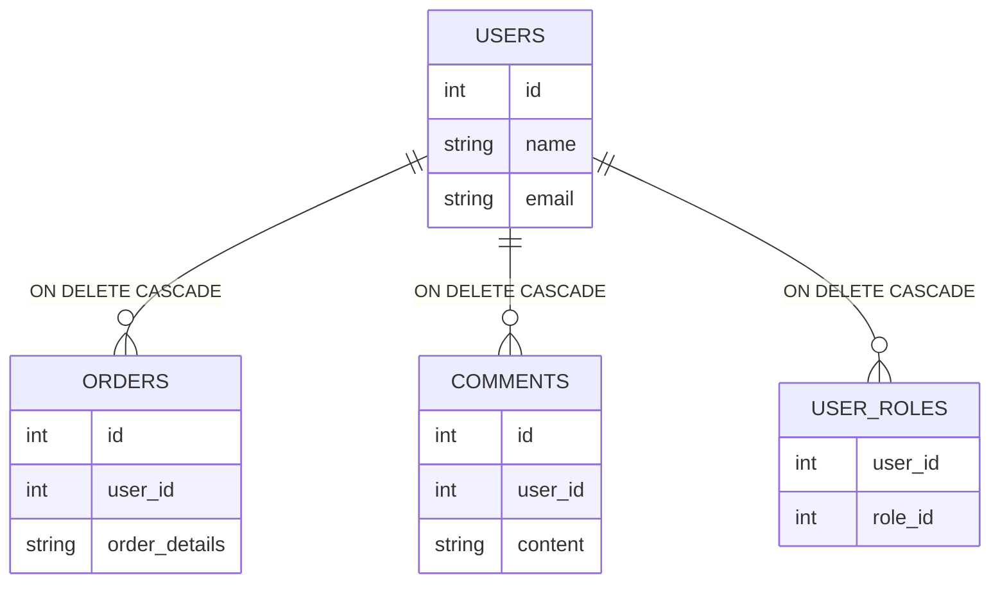

## 🎯 Acceptance Criteria

> [!NOTE]
> The following are developer friendly images and comments to explain what will be accepted as done.

I want a query that deletes a user based off a specific ID.

If the user exists then I want them to be deleted from the database and a successful response (OK 200) to be sent back to the backend.

If the user doesn't exist then I want a unsuccessful response (NOT FOUND 404) to be sent back to the backend.

If the query fails because of any other reason then I want a unsuccessful response (INTERNAL SERVER ERROR 500) to be sent back to the backend.

...(DELETE THIS PLACEHOLDER CONTENT)

## 🧪 Testing

> [!NOTE]
> The following are what the unit tests expect once development is done.

When the delete user query is ran with an id of a user that exists I **EXPECT**:
- The user to be deleted from the table and a successful code (OK 200) to be sent back.

---

When the delete user query is ran with an id of a user that doesn't exist I **EXPECT**:
- The query to fail and a unsuccessful code (NOT FOUND 500) to be sent back.

---

... (DELETE THIS PLACEHOLDER CONTENT)

## 🔗 Links & Notes

> [!NOTE]
> The following are links and any other notes to aid other developers and leads.

- [Google](google.com)
- I ran into an issue when implementing this and found this workaround...
- ... (DELETE THIS PLACEHOLDER CONTENT)
